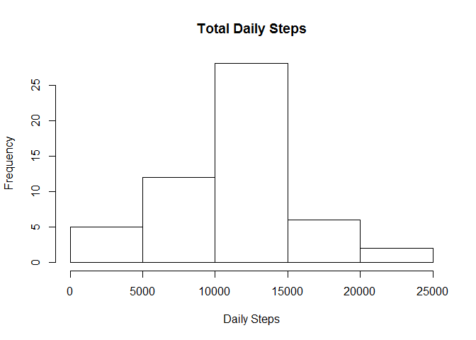
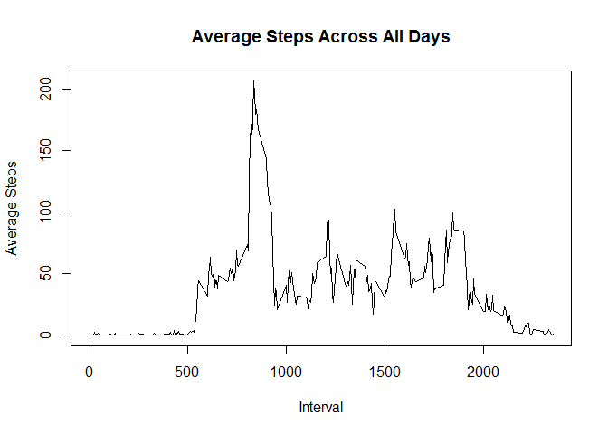
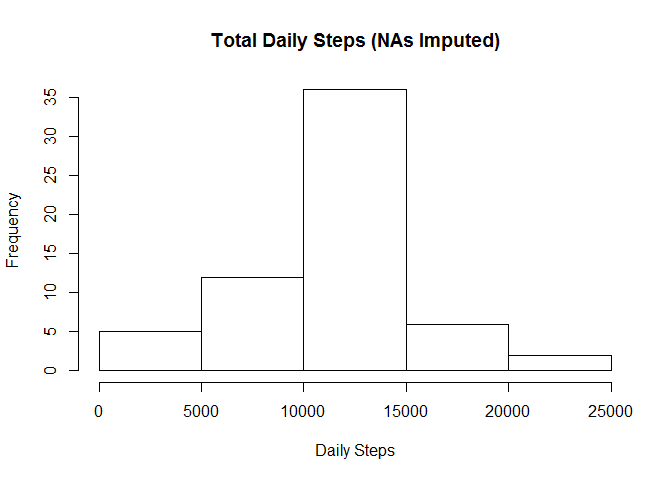
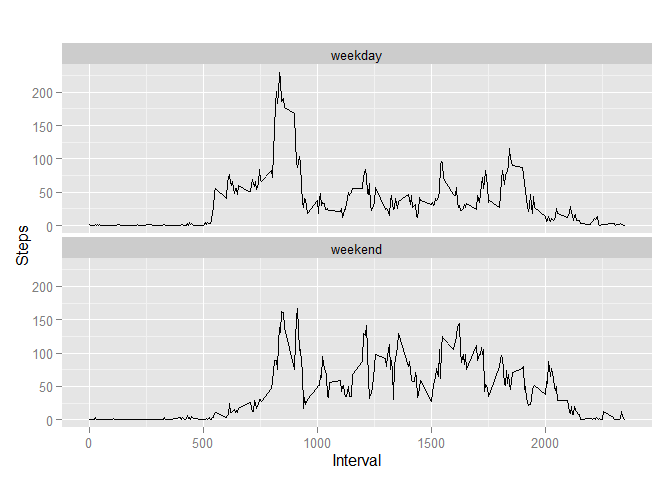

**NOTICE: README.md has been replaced with a direct copy of PA1_template.md for convenience when viewing on github**

# Reproducible Research: Peer Assessment 1
Flavius Popan  
October 18, 2015  


## Loading and preprocessing the data

```r
## ggplot2 import
library(ggplot2)
```

```r
## Extract the csv from the zip if it hasn't been done already
if (!file.exists("activity.csv")) {unzip("activity.zip")}

## Load the csv file as a dataset
activity_pre <- read.csv("activity.csv")

## Remove the NAs
activity <- activity_pre[with(activity_pre,{!(is.na(steps))}),]
```


## What is mean total number of steps taken per day?

```r
## Calculate total number of steps taken daily
daily_steps <- aggregate(activity$steps,by=list(activity$date),sum)

## Rename the columns to something more useful
names(daily_steps) <- c("date", "steps")

## Display the data
head(daily_steps)
```

```
##         date steps
## 1 2012-10-02   126
## 2 2012-10-03 11352
## 3 2012-10-04 12116
## 4 2012-10-05 13294
## 5 2012-10-06 15420
## 6 2012-10-07 11015
```

```r
## Make a histogram of step frequency
hist(daily_steps$steps, main="Total Daily Steps", 
xlab="Daily Steps")
```

 

```r
## Display the mean & median steps
mean(daily_steps$steps)
```

```
## [1] 10766.19
```

```r
median(daily_steps$steps)
```

```
## [1] 10765
```

**Mean: 10,766.19 - Median: 10,765**

## What is the average daily activity pattern?

```r
## Aggregate the steps into intervals by mean
interval <- aggregate(steps ~ interval, activity, mean)

## Plot time series
plot(interval$interval, interval$steps, type='l', 
main="Average Steps Across All Days", xlab="Interval", 
ylab="Average Steps")
```

 

```r
## Get max step row
max <- which.max(interval$steps)

## Find interval from max
interval[max, ]
```

```
##     interval    steps
## 104      835 206.1698
```

**Interval 835 has the highest number of steps on average (206.16)**


## Imputing missing values

```r
## Calculate the number of NAs
sum(is.na(activity_pre))
```

```
## [1] 2304
```

```r
## Make a copy of activity_pre
activity_post <- activity_pre

## Replace NAs with imputed data
# For every row in activity_pre
for (i in 1:nrow(activity_post)){
# If the row contains NA data in steps
if (is.na(activity_post$steps[i])){
# Replace the NA with the mean in the 5 minute interval
# that was already calculated in the interval dataframe
interval_val <- activity_post$interval[i]
row <- which(interval$interval == interval_val)
steps_val <- interval$steps[row]
activity_post$steps[i] <- steps_val
}
}

## Recalculate the total number of daily steps with new data
imputed_daily_steps <- aggregate(steps ~ date, activity_post, sum)
head(imputed_daily_steps)
```

```
##         date    steps
## 1 2012-10-01 10766.19
## 2 2012-10-02   126.00
## 3 2012-10-03 11352.00
## 4 2012-10-04 12116.00
## 5 2012-10-05 13294.00
## 6 2012-10-06 15420.00
```

```r
## Make a histogram of step frequency with imputed data
hist(imputed_daily_steps$steps, main="Total Daily Steps (NAs Imputed)", 
xlab="Daily Steps")
```

 

```r
## Mean and median of imputed data
mean(imputed_daily_steps$steps)
```

```
## [1] 10766.19
```

```r
median(imputed_daily_steps$steps)
```

```
## [1] 10766.19
```

**WITH NAs = Mean: 10,766.19 - Median: 10,765**
**IMPUTED = Mean: 10,766.19 - Median: 10,766.19**

**Summary: With inputed data, the mean remains unchanged but the median rose slightly**


## Are there differences in activity patterns between weekdays and weekends?

```r
## Create a new column to store weekday/weekend information
activity_post['day_type'] <- weekdays(as.Date(activity_post$date))
activity_post$day_type[activity_post$day_type  %in% c('Saturday','Sunday')] <- "weekend"
activity_post$day_type[activity_post$day_type != "weekend"] <- "weekday"

## Make day_type into a factor
activity_post$day_type <- as.factor(activity_post$day_type)

## Calculate average aggregate steps
imputed_interval <- aggregate(steps ~ interval + day_type, 
activity_post, mean)

## Make a plot to show differences in day_type over averaged intervals
qplot(interval, 
steps, 
data = imputed_interval, 
type = 'l', 
geom=c("line"),
xlab = "Interval", 
ylab = "Steps", 
main = "") +
facet_wrap(~ day_type, ncol = 1)
```

 

**More steps are taken earlier in the day on weekdays but more steps are taken
later in the evening on weekends**
